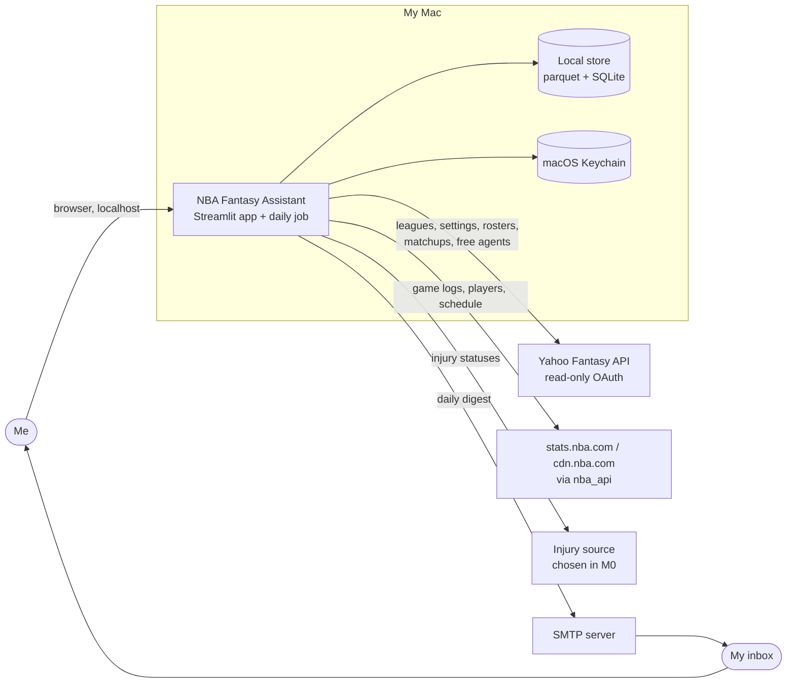
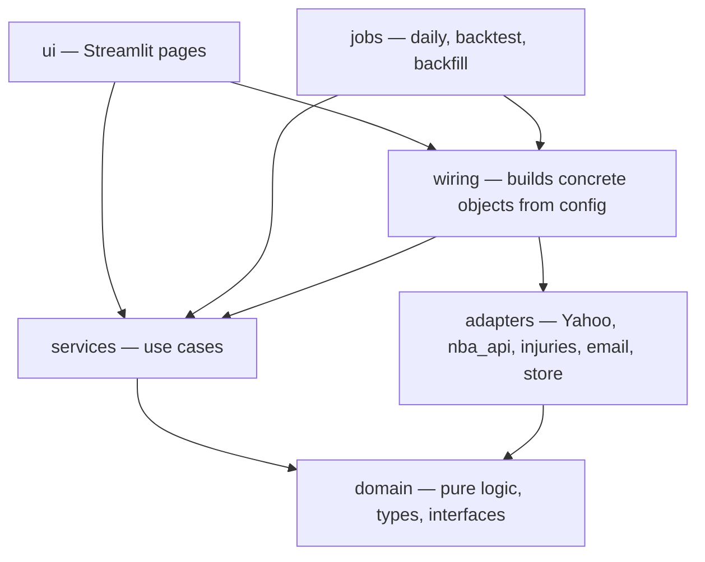
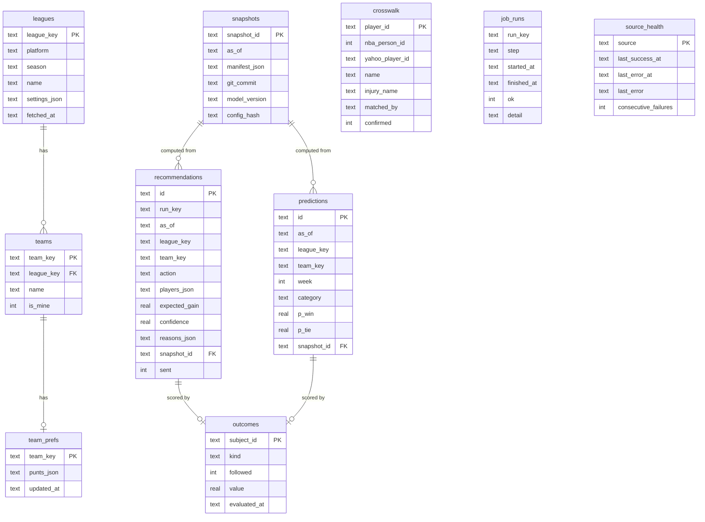
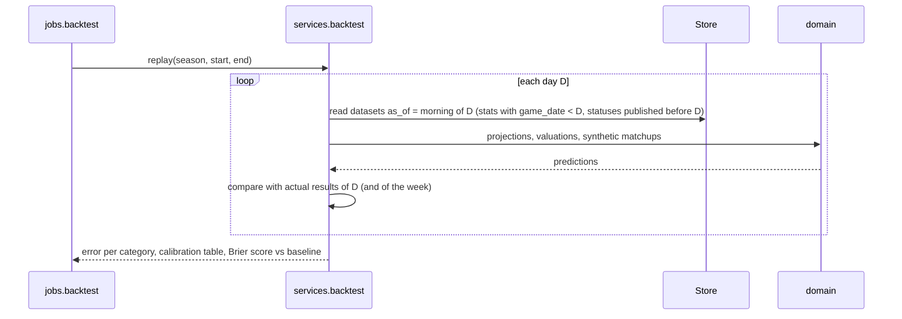

# NBA Fantasy Assistant — Architecture

Status: v1 design, written before the M0 spike. Sections marked **(M0)** will be revised with the spike's findings.
Last updated: 2026-10-01

This document is the source of truth for structure, interfaces, data and flows. `docs/PLAN.md` owns scope and requirements; the skills in `.claude/skills/` own conventions and domain rules. Decisions with lasting consequences are recorded in `docs/decisions/`.

## Contents

1. Drivers
2. System context
3. Runtime view
4. Components and layers
5. Interfaces
6. Data model and storage
7. Key flows
8. Time handling
9. Resilience and freshness
10. Configuration and secrets
11. Observability
12. Testing strategy
13. Extensibility walkthroughs
14. Requirements traceability
15. Open items for M0

---

## 1. Drivers

**Objectives** (from `docs/PLAN.md`): win more H2H category matchups (O1), under 5 minutes a day (O2), prove the advice works (O3), grow without rewrites (O4), explainable (O5), low upkeep (O6), calibrated (O7), fun/social (O8).

**Quality attributes, in priority order** (when two conflict, the higher one wins):

1. **Correctness and calibration.** Wrong numbers presented confidently are worse than no numbers.
2. **Extensibility.** New league, format, platform, source or notifier without touching the core.
3. **Resilience.** Unofficial sources break; the tool keeps working on cached data and says so.
4. **Low upkeep.** Problems diagnose themselves on the health page.
5. **Cost.** $0 to run.

Performance is not a driver: one user, a few leagues, data in the tens of MB.

**Constraints:** runs on one Mac; single user; Yahoo access read-only; NBA and Yahoo data used for personal use only and never committed; Python.

## 2. System context



## 3. Runtime view

Two entry points share one core. There is no server and no background daemon.

| Entry point | Started by | Does |
|---|---|---|
| **Streamlit app** (`nfa.ui.app`) | Me, on demand (`uv run streamlit run …`) | Reads the store, refreshes stale datasets on request, shows pages |
| **Daily job** (`python -m nfa.jobs.daily`) | launchd (`StartCalendarInterval`; runs on wake if the Mac slept) or by hand | Refreshes data, computes advice for every league and team, logs it, sends the digest |
| **Backtest** (`python -m nfa.jobs.backtest`) | Me, by hand | Replays a past period day by day and reports error and calibration |
| **Backfill** (`python -m nfa.jobs.backfill`) | Me, once per season | Downloads past seasons' game logs and the schedule |
| **Login** (`python -m nfa.jobs.login`) | Me, once (and when Yahoo asks again) | Yahoo OAuth login; stores tokens in the Keychain |

Both the app and the job call the same **services**. Anything the email says, the app can show, and vice versa.

Concurrency: the job and the app may run at the same time. SQLite runs in WAL mode; parquet datasets are written to a temporary file and renamed, so readers never see half-written files. Only the job writes to the recommendation log.

## 4. Components and layers



**Dependency rules**

- `domain` imports nothing from the other layers, and does no I/O: no network, files, environment, clock, or unseeded randomness.
- `services` depend on `domain` (types and interfaces), never on concrete adapters.
- `adapters` depend on `domain` and their own external library. Adapters never call each other.
- `ui` and `jobs` are thin: parse input, get `as_of` from the clock, call services, render. Only `ui`, `jobs` and `wiring` may read the real clock or config.
- A test (`tests/test_architecture.py`) enforces the import rules.

**Package layout**

```
src/nfa/
  domain/
    types.py            League, LeagueSettings, Category, Player, StatLine, Projection, Recommendation, …
    interfaces.py       FantasyPlatform, StatsSource, ScoringFormat, Notifier, Store (Protocols)
    identity.py         name normalization and matching rules used by the crosswalk builder
    minutes.py          minutes model, injury redistribution, probability of playing
    projections.py      rates, shrinkage, window projections
    scoring/h2h_categories.py   ScoringFormat for H2H categories: z-scores, impact, matchup outlook
    usable_games.py     daily slot assignment
    streaming.py        stream gain, add-limit timing, drop cost
    lineup.py           lineup checks
    punt.py             category profile, punt suggestions
    calibration.py      buckets, Brier score, projection error
    reasons.py          builds ordered reasons from computed contributions
  services/
    refresh.py          fetch datasets according to freshness policy; record health
    crosswalk.py        build and update the player ID crosswalk
    context.py          assemble a LeagueContext (settings, rosters, projections) for an as_of
    board.py  matchup.py  streaming.py  lineup.py  opportunities.py  punt.py
    digest.py           collect recommendations and render the email
    scorecard.py        outcomes and calibration from the log
    backtest.py         walk-forward replay
    health.py
  adapters/
    platforms/yahoo/    auth.py (own OAuth module), client.py, normalize.py, platform.py
    sources/nba_api_source.py
    sources/injuries/   one module per candidate source; one chosen in M0
    sources/composite.py   combines stats + injury providers into one StatsSource
    notifiers/email_smtp.py
    store/local.py      parquet datasets + SQLite; migrations/0001_init.sql, …
  jobs/   daily.py  backtest.py  backfill.py  login.py
  ui/     app.py  pages/ (board, matchup, streaming, lineup, punt, scorecard, health)
  wiring.py   config.py   clock.py
tests/   unit/  adapters/  services/  backtest/  fixtures/  test_architecture.py
scripts/ spike/  record_fixture.py  crosswalk_audit.py
```

## 5. Interfaces

All interfaces are `typing.Protocol`s in `domain/interfaces.py`. Every method that depends on time takes `as_of` explicitly.

```python
class FantasyPlatform(Protocol):
    name: str                                                   # "yahoo"
    def my_leagues(self, season: str) -> list[LeagueRef]: ...
    def settings(self, league: LeagueKey) -> LeagueSettings: ...
    def teams(self, league: LeagueKey) -> list[TeamRef]: ...    # includes is_mine
    def roster(self, team: TeamKey, on: date) -> Roster: ...
    def matchup(self, team: TeamKey, week: int) -> Matchup: ...  # opponent + accumulated category stats
    def available_players(self, league: LeagueKey, limit: int) -> list[AvailablePlayer]: ...  # FA + waivers, % owned
    def players(self, league: LeagueKey) -> list[PlatformPlayer]: ...  # ids, names, teams, eligibility, status

class StatsSource(Protocol):
    name: str
    def players(self, season: str) -> list[SourcePlayer]: ...
    def game_logs(self, season: str, since: date | None = None) -> list[StatLine]: ...
    def schedule(self, season: str) -> list[ScheduledGame]: ...
    def injuries(self, as_of: datetime) -> list[InjuryStatus]: ...    # each with published_at

class ScoringFormat(Protocol):
    name: str                                                   # "h2h_categories"
    def player_values(self, projections: Sequence[Projection], settings: LeagueSettings,
                      weights: Mapping[str, float] | None = None) -> dict[PlayerId, Valuation]: ...
    def matchup_outlook(self, mine: WeekState, theirs: WeekState,
                        settings: LeagueSettings) -> MatchupOutlook: ...
    def move_gain(self, before: MatchupOutlook, after: MatchupOutlook) -> float: ...

class Notifier(Protocol):
    def send(self, message: Message) -> None: ...               # subject, html, text

class Store(Protocol):
    # datasets (parquet), append-only with versions
    def write_dataset(self, name: str, rows: Any, meta: DatasetMeta) -> DatasetVersion: ...
    def read_dataset(self, name: str, as_of: datetime | None = None) -> tuple[Any, DatasetMeta] | None: ...
    # records (SQLite)
    def crosswalk(self) -> Crosswalk: ...
    def save_crosswalk(self, entries: Sequence[CrosswalkEntry]) -> None: ...
    def team_prefs(self, team: TeamKey) -> TeamPrefs: ...
    def save_team_prefs(self, prefs: TeamPrefs) -> None: ...
    def save_snapshot(self, snapshot: Snapshot) -> str: ...
    def log_recommendations(self, recs: Sequence[Recommendation]) -> None: ...
    def log_predictions(self, preds: Sequence[Prediction]) -> None: ...
    def record_outcomes(self, outcomes: Sequence[Outcome]) -> None: ...
    def record_run(self, run: JobRun) -> None: ...
    def record_health(self, event: HealthEvent) -> None: ...
```

Notes:

- **Injuries are part of `StatsSource`**, so the injury provider can change without touching services. `sources/composite.py` combines the `nba_api` adapter with the chosen injury adapter into one `StatsSource`.
- **`ScoringFormat`** owns everything that differs between H2H categories, points and roto. Projections are format-independent (raw stats including makes and attempts); valuation and matchup outlook are not.
- **`Store`** is one facade over two kinds of storage. It could be split later if a hosted database arrives; services only see the protocol.

## 6. Data model and storage

### Entities

| Entity | Key | Holds |
|---|---|---|
| League | `league_key` (`yahoo:466.l.12345`) | platform, season, name |
| LeagueSettings | league_key + fetched_at | categories (with direction, ratio parts, display-only flag), active/bench/IL slots, add limits, week dates, playoff weeks, lock rule |
| Team | `team_key` | league, name, manager is me or not |
| TeamPrefs | team_key | punted categories, notes |
| Player | `player_id` (internal) | name, NBA team, eligibility per league |
| CrosswalkEntry | player_id | NBA person ID, Yahoo player ID, injury-source name, how matched, confirmed |
| ScheduledGame | NBA game ID | date (ET), tip time, home, away |
| StatLine | player_id + game ID | minutes, raw stats incl. makes and attempts |
| InjuryStatus | player_id + published_at | status, detail, source |
| RosterEntry | team_key + date + player_id | slot that day |
| WeekState | team_key + week + as_of | accumulated stats, remaining player-games in active slots |
| Projection | player_id + window + as_of | expected games, per-game stats and variances, model version |
| Valuation | player_id + league + as_of | per-category z / impact, total, weights used |
| MatchupOutlook | team_key + week + as_of | per-category projected totals and win/tie probabilities, expected categories won, matchup win probability |
| Recommendation | id | see §5 and `references/domain-types.md` |
| Prediction | id | a probability we can score later (category or matchup win) |
| Snapshot | snapshot_id | manifest of dataset versions + code and config versions |
| Outcome | recommendation or prediction id | followed or not, actual result |
| JobRun | run_key + step | started, finished, ok, detail |
| HealthEvent | source + time | success or error, data age |

### Where things live

```
data/                          gitignored (except data/crosswalk_overrides.json)
  cache/
    nba/players/season=2026-27/…parquet
    nba/game_logs/season=2026-27/…parquet         immutable once games are final
    nba/schedule/season=2026-27/…parquet
    injuries/published_date=YYYY-MM-DD/…parquet    append-only history
    yahoo/<league>/settings/…, rosters/date=…/, matchups/week=…/, available/date=…/
  app.sqlite                    WAL mode
  logs/                         rotated structured logs
data/crosswalk_overrides.json   committed: manual fixes for ambiguous matches
```

- **Parquet** for bulk, columnar, mostly append-only data (stats, schedule, injury and Yahoo snapshots).
- **SQLite** for small relational records that need transactions and queries: crosswalk, team prefs, snapshots, recommendations, predictions, outcomes, job runs, health. Schema changes go through numbered SQL files in `adapters/store/migrations/`, tracked in a `schema_migrations` table.

### Snapshots without copying data

Datasets are append-only and versioned (`DatasetMeta`: name, version, `fetched_at`, source, row count, content hash). A **snapshot** is a manifest: the dataset versions used, the git commit, the model version and a hash of the config. Recomputing a recommendation means loading those versions and running the same code. Nothing is copied per recommendation.

### SQLite tables (v1)



## 7. Key flows

### 7.1 Daily job

```mermaid
sequenceDiagram
    participant L as launchd
    participant J as jobs.daily
    participant R as services.refresh
    participant C as services.context
    participant A as advice services
    participant S as Store
    participant D as services.digest
    participant N as Notifier

    L->>J: start (or I run it with --as-of / --dry-run)
    J->>S: run_key = date; skip steps already ok today
    J->>R: refresh(as_of): schedule, game logs, injuries, Yahoo settings, rosters, matchups, available players
    R->>S: write datasets + health events (failures fall back to cache, marked stale)
    loop each league and my team
        J->>C: build LeagueContext(as_of)
        C->>A: lineup check, matchup outlook, streaming, opportunities
        A-->>J: recommendations + predictions (with reasons)
        J->>S: save snapshot, log recommendations and predictions
    end
    J->>S: score yesterday's outcomes (scorecard)
    J->>D: render digest (alerts first, stale-data and late notes)
    D->>N: send (skipped with --dry-run or if already sent today)
    J->>S: record run steps
```

A failure in one league is recorded and the job continues with the others. The digest says what failed.

### 7.2 Opening a Streamlit page

1. The page asks a service for its view (e.g. `matchup.outlook(team, as_of=now)`).
2. The service reads datasets from the store. If a dataset is older than its max age, the page shows a "refresh" button and the data age. It does not block on the network.
3. Refresh calls `services.refresh` for that dataset only, then re-renders.

### 7.3 Injury status change to opportunity alert

1. `refresh` fetches injuries; new rows are appended with `published_at`.
2. `opportunities` compares the latest status to the previous one per player. For each player who became Out, `domain.minutes` recomputes teammates' expected minutes (redistribution parameters are open decisions, see §15) and `projections` updates their windows.
3. Teammates who are available in one of my leagues and whose value rises above a threshold become `ALERT` recommendations with reasons ("+6.5 expected minutes while X is out; 3 games this week").

### 7.4 Walk-forward backtest



- The store enforces the cut-off (`read_dataset(name, as_of)`), so look-ahead is prevented in one place and tested there.
- **Limitation:** we have no recorded injury statuses for 2025-26, and inferring them from who did not play would be look-ahead. The historical backtest therefore measures **rates and minutes given who played**, and status handling is measured live this season from recorded statuses. Synthetic matchups are built from last season's player pool, since real Yahoo rosters for that season are not available.

### 7.5 Yahoo OAuth login and refresh

Our own small module (`adapters/platforms/yahoo/auth.py`, see ADR 0006):

1. First login (`python -m nfa.jobs.login`): print the authorize URL, I log in and approve, then paste the code (out-of-band) or the local redirect catches it **(M0: which redirect Yahoo accepts)**.
2. Exchange the code for access and refresh tokens; store both in the Keychain.
3. Before each request: refresh if the access token expires within 5 minutes.
4. If refresh fails: record a health event "Yahoo login needed", skip Yahoo steps, and say so in the digest and on the health page.

## 8. Time handling

- `as_of` is a timezone-aware `datetime`. Only `clock.py` (used by `ui`, `jobs`, `wiring`) reads the real time.
- **NBA day** = the US/Eastern calendar date of a game. Game dates, schedules and Yahoo dates are stored as ET dates; display converts to my local time.
- A Yahoo scoring week is identified by its number and its start and end dates from league settings, never computed from the weekday alone.
- "Morning of D" for backtests = before the first game of ET date D, with stats from games completed before D.
- Default daily job time: configurable; it should fall after the previous night's games are final and before the earliest tip of the day (weekend games can start around midday ET). The digest marks itself late if it runs after the first lock.

## 9. Resilience and freshness

Every fetch returns one of: **fresh**, **cached (stale)** with the cached data and its age, or **failed** with no usable data. Services decide what to do; the UI and digest always show the data age.

Initial freshness policy (to tune in M1):

| Dataset | Source | Refreshed | Max age before "stale" | Fallback |
|---|---|---|---|---|
| Game logs | `nba_api` | daily job; on request | 24 h | Yahoo player stats by date (fewer columns) |
| Players (NBA) | `nba_api` | daily job | 7 days | cache |
| Schedule | `nba_api` / cdn.nba.com | weekly; on request | 7 days | cache |
| Injuries | chosen in M0 | daily job; on request | 3 h | Yahoo player status |
| League settings | Yahoo | daily job | 24 h | cache |
| Rosters, matchups | Yahoo | daily job; on request | 1 h | cache |
| Available players | Yahoo | daily job; on request | 6 h | cache |
| Crosswalk | built locally | when unmatched players appear | — | overrides file |

Request hygiene for every adapter: timeout on every call, throttling per source, retries with exponential backoff and jitter for transient errors (max 3), never retry auth errors, and record every failure in `source_health`.

## 10. Configuration and secrets

- `config.toml` (gitignored), with `config.example.toml` committed:
  - season, leagues to include or exclude (default: all my NBA leagues)
  - digest recipients (me), send time, SMTP host and port
  - freshness overrides, throttle rates, free-agent depth
  - model settings with placeholders clearly labelled
- **Secrets** in the macOS Keychain via `keyring`, under one service name: Yahoo client ID and secret, Yahoo tokens, SMTP password. Never in config files, logs, fixtures or exceptions.
- **Per-team preferences** (punts) live in SQLite and are edited from the punt page.

## 11. Observability

- Structured logs (JSON lines) via `logging` to `data/logs/`, rotated. One line per job step and per fetch: source, dataset, duration, outcome, rows.
- `job_runs` and `source_health` tables feed the **health page**: last successful run, each source's last success and data age, consecutive failures, unmatched players in the crosswalk, Yahoo login state.
- The digest ends with a short health section and leads with it when something is broken.

## 12. Testing strategy

Details in `.claude/skills/nfa-engineering/references/testing.md`.

- **Domain:** unit tests with hand-built inputs; one behavior per test.
- **Adapters:** parse recorded fixtures (secrets and private names removed) into domain types; one fixture per league variant.
- **Services:** fake adapters implementing the protocols; failure paths included.
- **Store:** look-ahead tests on `read_dataset(as_of=…)`, migration tests on an empty database.
- **Architecture:** import-rule test.
- **Jobs:** daily job idempotency (two runs → one email, one set of log entries).
- No test uses the network.

## 13. Extensibility walkthroughs

| Change | What is added | What changes elsewhere |
|---|---|---|
| **ESPN leagues** | `adapters/platforms/espn/` implementing `FantasyPlatform`; ESPN IDs in the crosswalk | `wiring` registers it; config lists ESPN leagues. Domain and services unchanged. |
| **Points leagues** | `domain/scoring/h2h_points.py` implementing `ScoringFormat` | Settings parsing maps Yahoo points settings; pages pick the format from the league. Projections unchanged. |
| **Telegram notifier** | `adapters/notifiers/telegram.py` | Config chooses the notifier. The digest renders a shorter text variant. |
| **Licensed stats feed** | New `StatsSource` adapter | Crosswalk gains that feed's IDs. Domain unchanged. |
| **Multiple users / hosting** | Hosted DB `Store`, per-user Yahoo tokens, a web front end (e.g. FastAPI + React) calling the same services, a scheduler instead of launchd | Needs licensed data (stats.nba.com blocks cloud IPs and its terms are for personal use) and accounts, privacy and billing. A separate product decision; the core stays. |

## 14. Requirements traceability

| Requirement | Where |
|---|---|
| FR-A1–A4 Yahoo connection | `adapters/platforms/yahoo/*`, ADR 0002, 0006, §7.5 |
| FR-B1–B2 Stats, schedule, injuries | `adapters/sources/*`, `services/refresh.py`, ADR 0004 |
| FR-B3 Crosswalk | `domain/identity.py`, `services/crosswalk.py`, `crosswalk` table |
| FR-C1–C3 Projections | `domain/projections.py`, `domain/minutes.py` |
| FR-D1–D2 Valuation | `domain/scoring/h2h_categories.py` |
| FR-E1 Player board | `services/board.py`, `ui/pages/board` |
| FR-E2 Matchup projector | `services/matchup.py`, `ScoringFormat.matchup_outlook` |
| FR-E3 Streaming ranker | `domain/streaming.py`, `domain/usable_games.py`, `services/streaming.py` |
| FR-E4 Lineup check | `domain/lineup.py`, `services/lineup.py` |
| FR-F1–F2 Daily digest | `jobs/daily.py`, `services/digest.py`, `adapters/notifiers/email_smtp.py`, §7.1 |
| FR-G1–G2 Recommendation log, scorecard | `recommendations`, `predictions`, `outcomes`, `snapshots` tables; `services/scorecard.py` |
| FR-H1–H2 Schedule, usable games | `nba/schedule` dataset, `domain/usable_games.py` |
| FR-I1–I2 Injury opportunities | `services/opportunities.py`, §7.3 |
| FR-J1–J3 Backtest, calibration | `services/backtest.py`, `domain/calibration.py`, §7.4 |
| FR-K1–K3 Punt analysis | `domain/punt.py`, `services/punt.py`, `team_prefs` table |
| FR-X1 Reasons | `domain/reasons.py`, `Recommendation.reasons` |
| FR-X2 Health | `services/health.py`, `source_health`, `job_runs`, §11 |

## 15. Open items for M0

To verify against the real services and leagues (from the "(verify)" notes in the skill references):

- [ ] Yahoo redirect URI: does `oob` still work, or is a local HTTPS redirect needed?
- [ ] Yahoo player ID stable across seasons?
- [ ] Exact `settings` fields: stat categories (sort order, display-only), `roster_positions`, weekly add limits, week dates, playoff weeks, lock rule.
- [ ] Default roster slots and IL / IL+ eligibility in our leagues.
- [ ] Lineup lock rule used in our leagues.
- [ ] Yahoo player status codes.
- [ ] Rate-limit behavior and error codes seen in practice.
- [ ] Scoring weeks longer than 7 days this season (start, All-Star break).
- [ ] `nba_api` schedule endpoint columns; cdn.nba.com schedule URL.
- [ ] `nba_api` works from home IP; time and rows for a full-season game log pull.
- [ ] Injury source: pick one of the official NBA report, ESPN, or Yahoo status only, based on reliability of parsing and timeliness.
- [ ] Crosswalk auto-match rate for rostered players (target ≥ 98%).

Open model decisions (decided with the user, from NBA data, never from the EuroLeague tool):

- [ ] Injury minutes redistribution: split by position or role, per-player cap.
- [ ] Shrinkage constants per stat.
- [ ] Probability of playing per status and for back-to-backs.
- [ ] Opportunity alert threshold.
- [ ] Drop-cost weight (λ) in stream gain.
