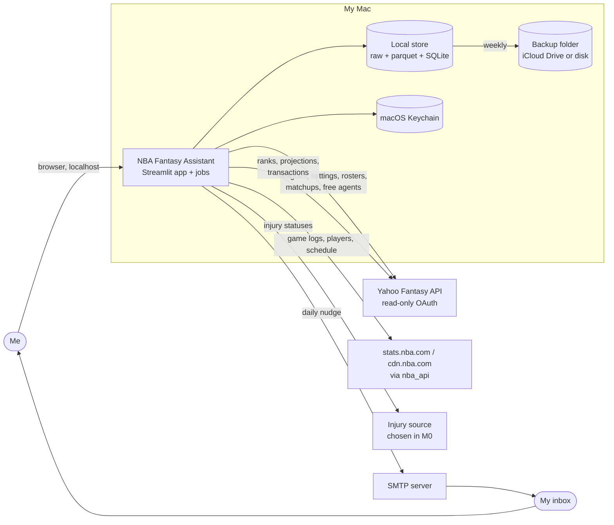
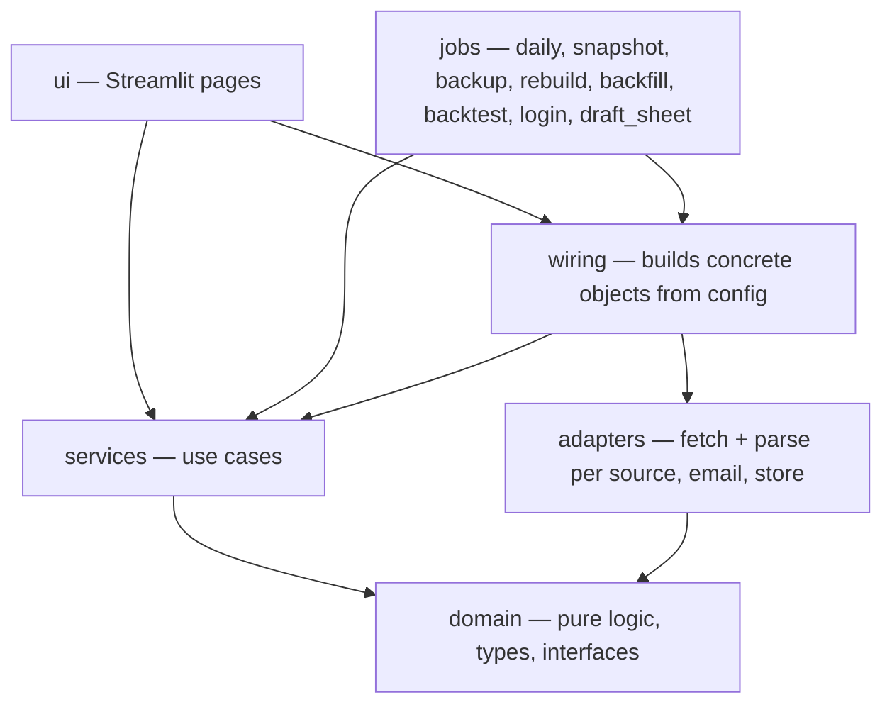
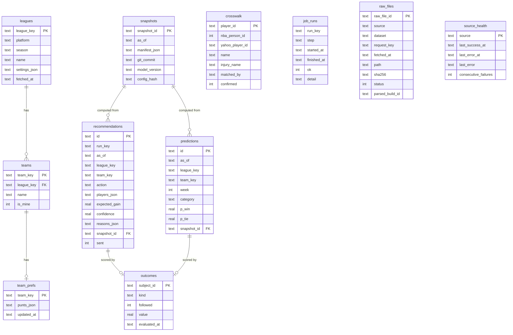
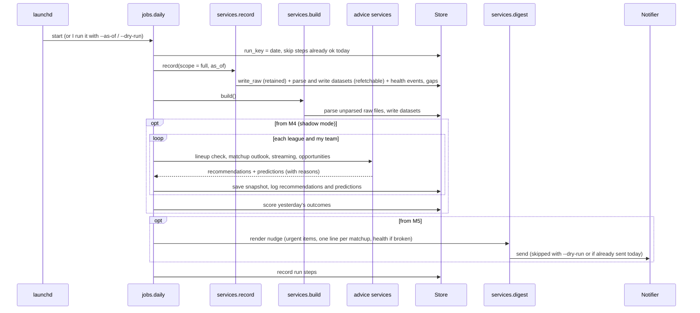
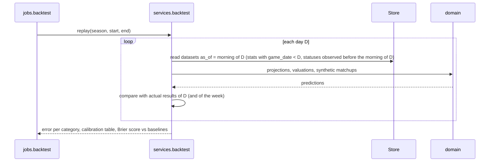

# NBA Fantasy Assistant — Architecture

Status: v1 design, revised 2026-10-02 (spec: `docs/superpowers/specs/2026-10-02-architecture-and-functionality-design.md`). Sections marked **(M0)** will be revised with the spike's findings.
Last updated: 2026-10-02

This document is the source of truth for structure, interfaces, data and flows. `docs/PLAN.md` owns scope and requirements; the skills in `.claude/skills/` own conventions and domain rules. Decisions with lasting consequences are recorded in `docs/decisions/`.

## Contents

1. Drivers
2. System context
3. Runtime view
4. Components and layers
5. Interfaces
6. Data model and storage
7. Key flows
8. Time handling
9. Resilience and freshness
10. Configuration and secrets
11. Observability
12. Testing strategy
13. Extensibility walkthroughs
14. Requirements traceability
15. Open items for M0

---

## 1. Drivers

**Objectives** (from `docs/PLAN.md`): win more H2H category matchups (O1), under 5 minutes a day (O2), prove the advice works (O3), grow without rewrites (O4), explainable (O5), low upkeep (O6), calibrated (O7), fun/social (O8).

**Season plan:** 2026-27 is a test bed; v1 targets the 2027-28 season (ADR 0007). Data that cannot be fetched again is recorded from M1.

**Quality attributes, in priority order** (when two conflict, the higher one wins):

1. **Correctness and calibration.** Wrong numbers presented confidently are worse than no numbers.
2. **Extensibility.** New league, format, platform, source or notifier without touching the core.
3. **Resilience.** Unofficial sources break; the tool keeps working on cached data and says so.
4. **Low upkeep.** Problems diagnose themselves on the health page.
5. **Cost.** $0 to run.

Performance is not a driver: one user, a few leagues, data in the tens of MB.

**Constraints:** runs on one Mac; single user; Yahoo access read-only; NBA and Yahoo data used for personal use only and never committed; Python; the Mac sleeps, so recording has gaps that must be visible.

## 2. System context



## 3. Runtime view

Two entry points share one core. There is no server and no background daemon.

| Entry point | Started by | Does |
|---|---|---|
| **Streamlit app** (`nfa.ui.app`) | Me, on demand | Reads the store; Today page and tool pages; can trigger a `record` + `build` for one league |
| **Daily** (`python -m nfa.jobs.daily`) | launchd, each morning ET; or by hand | `record` → `build` → `advise` (M4) → `notify` (M5); each step recorded and safe to re-run; `--as-of`, `--dry-run` |
| **Snapshot** (`nfa.jobs.snapshot`) | launchd, about every 2 h on game days | `record` + `build` for injuries and free agents only |
| **Backup** (`nfa.jobs.backup`) | launchd, weekly | Archives `data/raw` and `app.sqlite` to the backup folder; keeps the last 8 |
| **Rebuild** (`nfa.jobs.rebuild`) | Me, after a parser fix | Re-parses all raw files into datasets |
| **Backfill** (`nfa.jobs.backfill`) | Me, once per season | Last season's box scores and schedule |
| **Backtest** (`nfa.jobs.backtest`) | Me | Walk-forward replay, calibration, baselines |
| **Login** (`nfa.jobs.login`) | Me, once and when Yahoo asks | Yahoo OAuth; tokens to the Keychain |
| **Draft sheet** (`nfa.jobs.draft_sheet`) | Me, before drafts (M6) | Pre-draft rankings per league and punt build; CSV |

The app and all jobs call the same **services**. Anything the email says, the app can show, and vice versa.

Concurrency: the job and the app may run at the same time. SQLite runs in WAL mode; parquet datasets are written to a temporary file and renamed, so readers never see half-written files. Raw files are written to a temporary name and renamed, then listed in `raw_files` in the same transaction as their job step. Only the job writes to the recommendation log.

## 4. Components and layers



**Dependency rules**

- `domain` imports nothing from the other layers, and does no I/O: no network, files, environment, clock, or unseeded randomness.
- `services` depend on `domain` (types and interfaces), never on concrete adapters.
- `adapters` depend on `domain` and their own external library. Adapters never call each other.
- `ui` and `jobs` are thin: parse input, get `as_of` from the clock, call services, render. Only `ui`, `jobs` and `wiring` may read the real clock or config.
- **Parse functions are pure**: they take a `RawResponse` and return `DatasetRows`, with no I/O and no clock; the import-rule test treats `adapters/*/parse.py` like `domain` (stdlib, pandas and `domain` only).
- A test (`tests/test_architecture.py`) enforces the import rules.

**Package layout**

```
src/nfa/
  domain/
    types.py            League, LeagueSettings, Category, Player, StatLine, Projection, Recommendation, …
    raw.py              RawResponse, FetchRequest, RecordScope, DatasetRows
    datasets.py         row types and schemas for every normalized dataset (the contract adapters must produce)
    interfaces.py       Fetcher, Parser, FantasyPlatform, StatsSource, InjuryFeed, ScoringFormat, Notifier, Store
    identity.py         name normalization and matching rules used by the crosswalk builder
    minutes.py          minutes model, injury redistribution, probability of playing
    projections.py      rates, shrinkage, window projections
    baselines.py        season-average baseline; comparison against Yahoo ranks; acceptance gate
    scoring/h2h_categories.py   ScoringFormat for H2H categories: z-scores, impact, matchup outlook
    usable_games.py     daily slot assignment
    streaming.py        stream gain, add-limit timing, drop cost
    lineup.py           lineup checks
    punt.py             category profile, punt suggestions
    draft.py            season-long values per punt build
    calibration.py      buckets, Brier score, projection error
    reasons.py          builds ordered reasons from computed contributions
  services/
    record.py           run fetchers for a RecordScope; keep raw for retained datasets; parse refetchable
                        responses (box scores, schedule, NBA players) in-process into datasets; record gaps and health
    build.py            parse unparsed raw files into datasets; rebuild
    crosswalk.py        build and update the player ID crosswalk
    context.py          assemble a LeagueContext (settings, rosters, projections) for an as_of
    today.py            the Today page view per team
    board.py  matchup.py  streaming.py  lineup.py  opportunities.py  punt.py  draft_sheet.py
    digest.py           collect urgent items and render the nudge email
    scorecard.py        outcomes, calibration and baselines from the log
    backtest.py         walk-forward replay
    backup.py           archive raw files and SQLite
    health.py
  adapters/
    platforms/yahoo/    auth.py (own OAuth module), fetch.py, parse.py
    sources/nba_api/    fetch.py, parse.py
    sources/injuries/<provider>/   fetch.py, parse.py (one provider, chosen in M0)
    notifiers/email_smtp.py
    store/local.py      raw files + parquet datasets + SQLite; store/migrations/0001_init.sql, …
  jobs/   daily.py  snapshot.py  backup.py  rebuild.py  backfill.py  backtest.py  login.py  draft_sheet.py
  ui/     app.py  pages/ (today, board, schedule, streaming, punt, draft, scorecard, health)
  wiring.py   config.py   clock.py
tests/   unit/  adapters/  services/  backtest/  fixtures/raw/  test_architecture.py
scripts/ spike/  scrub_fixture.py  crosswalk_audit.py
```

## 5. Interfaces

All interfaces are `typing.Protocol`s in `domain/interfaces.py`. Every method that depends on time takes `as_of` explicitly.

```python
# domain/raw.py
RawFileId = NewType("RawFileId", str)

@dataclass(frozen=True)
class FetchRequest:
    source: str            # "yahoo", "nba_api", "injuries:<provider>"
    dataset: str           # "rosters", "free_agents", "game_logs", …
    key: str               # e.g. "466.l.12345.t.3;date=2026-10-21"
    params: Mapping[str, str]

@dataclass(frozen=True)
class RawResponse:
    request: FetchRequest
    fetched_at: datetime   # timezone-aware
    status: int
    payload: bytes         # body as received

@dataclass(frozen=True)
class RecordScope:
    as_of: datetime
    kind: Literal["full", "snapshot"]     # snapshot = injuries + free agents only
    leagues: Sequence[LeagueKey]

@dataclass(frozen=True)
class DatasetRows:
    dataset: str           # a name from domain/datasets.py
    rows: Sequence[Any]    # row type defined for that dataset in domain/datasets.py
    observed_at: datetime

# domain/interfaces.py
class Fetcher(Protocol):
    source: str
    retain_raw: frozenset[str]                                   # datasets whose raw responses are kept
    def requests(self, scope: RecordScope) -> list[FetchRequest]: ...   # pure: what to fetch
    def fetch(self, request: FetchRequest) -> RawResponse: ...          # network; raises FetchError

class Parser(Protocol):
    source: str
    def parse(self, raw: RawResponse) -> list[DatasetRows]: ...         # pure

class FantasyPlatform(Fetcher, Parser, Protocol):
    name: str              # "yahoo"; produces league_settings, teams, rosters, matchups,
                           # transactions, available_players, player_ranks, platform_players

class StatsSource(Fetcher, Parser, Protocol):
    name: str              # produces nba_players, game_logs, schedule

class InjuryFeed(Fetcher, Parser, Protocol):
    name: str              # produces injury_reports

class ScoringFormat(Protocol):
    name: str                                                   # "h2h_categories"
    def player_values(self, projections: Sequence[Projection], settings: LeagueSettings,
                      weights: Mapping[str, float] | None = None) -> dict[PlayerId, Valuation]: ...
    def matchup_outlook(self, mine: WeekState, theirs: WeekState,
                        settings: LeagueSettings) -> MatchupOutlook: ...
    def move_gain(self, before: MatchupOutlook, after: MatchupOutlook) -> float: ...

class Notifier(Protocol):
    def send(self, message: Message) -> None: ...               # subject, html, text

class Store(Protocol):
    # raw tier
    def write_raw(self, raw: RawResponse) -> RawFileId: ...
    def unparsed_raw(self, source: str | None = None) -> Iterator[tuple[RawFileId, RawResponse]]: ...
    def all_raw(self, source: str | None = None) -> Iterator[tuple[RawFileId, RawResponse]]: ...
    def mark_parsed(self, ids: Sequence[RawFileId], build_id: str) -> None: ...
    # datasets (parquet)
    def write_dataset(self, data: DatasetRows, meta: DatasetMeta) -> DatasetVersion: ...
    def read_dataset(self, name: str, as_of: datetime | None = None) -> tuple[Any, DatasetMeta] | None: ...
    # records (SQLite)
    def crosswalk(self) -> Crosswalk: ...
    def save_crosswalk(self, entries: Sequence[CrosswalkEntry]) -> None: ...
    def team_prefs(self, team: TeamKey) -> TeamPrefs: ...
    def save_team_prefs(self, prefs: TeamPrefs) -> None: ...
    def save_snapshot(self, snapshot: Snapshot) -> str: ...
    def log_recommendations(self, recs: Sequence[Recommendation]) -> None: ...
    def log_predictions(self, preds: Sequence[Prediction]) -> None: ...
    def record_outcomes(self, outcomes: Sequence[Outcome]) -> None: ...
    def record_run(self, run: JobRun) -> None: ...
    def record_health(self, event: HealthEvent) -> None: ...
    def backup(self, dest: Path, keep: int) -> Path: ...
```

Notes:

- **Source adapters are a fetcher plus a parser** (ADR 0008). The contract between an adapter and the rest of the system is the set of datasets it produces, with row types in `domain/datasets.py`. A new platform (ESPN) produces the same datasets.
- **Injuries have their own interface** (`InjuryFeed`, ADR 0009).
- **`ScoringFormat`** owns everything that differs between H2H categories, points and roto. Projections are format-independent (raw stats including makes and attempts); valuation and matchup outlook are not.
- **`Store`** is one facade over three kinds of storage (raw files, parquet, SQLite). It could be split later if a hosted database arrives; services only see the protocol.

## 6. Data model and storage

### Entities

| Entity | Key | Holds |
|---|---|---|
| League | `league_key` (`yahoo:466.l.12345`) | platform, season, name |
| LeagueSettings | league_key + fetched_at | categories (with direction, ratio parts, display-only flag), active/bench/IL slots, add limits, week dates, playoff weeks, lock rule |
| Team | `team_key` | league, name, manager is me or not |
| TeamPrefs | team_key | punted categories, notes |
| Player | `player_id` (internal) | name, NBA team, eligibility per league |
| CrosswalkEntry | player_id | NBA person ID, Yahoo player ID, injury-source name, how matched, confirmed |
| ScheduledGame | NBA game ID | date (ET), tip time, home, away |
| StatLine | player_id + game ID | minutes, raw stats incl. makes and attempts |
| InjuryStatus | player_id + observed_at | status, detail, source, published_at |
| RosterEntry | team_key + date + player_id | slot that day |
| WeekState | team_key + week + as_of | accumulated stats, remaining player-games in active slots |
| Projection | player_id + window + as_of | expected games, per-game stats and variances, model version |
| Valuation | player_id + league + as_of | per-category z / impact, total, weights used |
| MatchupOutlook | team_key + week + as_of | per-category projected totals and win/tie probabilities, expected categories won, matchup win probability |
| Recommendation | id | see §5 and `references/domain-types.md` |
| Prediction | id | a probability we can score later (category or matchup win) |
| Snapshot | snapshot_id | manifest of dataset versions + code and config versions |
| Outcome | recommendation or prediction id | followed or not, actual result |
| JobRun | run_key + step | started, finished, ok, detail |
| HealthEvent | source + time | success or error, data age |
| RawFile | raw_file_id | source, dataset, request key, `fetched_at`, path, sha256, status, parsed build id |
| PlayerRank | league + player_id + observed_at | Yahoo rank and projection values as shown that day |
| Transaction | league + transaction id | type (add, drop, trade), team, players, time |

### Where things live

```
data/                          gitignored (except data/crosswalk_overrides.json)
  raw/{source}/{dataset}/{YYYY-MM-DD}/{HHMMSS}-{key}.json.gz   append-only, kept indefinitely
  datasets/
    nba_players/season=2026-27/…parquet
    game_logs/season=2026-27/…parquet        immutable once games are final
    schedule/season=2026-27/…parquet
    injury_reports/season=2026-27/…parquet   rebuilt from raw
    yahoo/<dataset>/season=2026-27/…parquet  league_settings, teams, rosters, matchups,
                                             transactions, available_players, player_ranks
  app.sqlite                    WAL mode
  logs/                         rotated structured logs
data/crosswalk_overrides.json   committed: manual fixes for ambiguous matches
<backup folder from config>/nfa-backup-YYYY-MM-DD.tar.gz   last 8 kept
```

- **Raw** for responses that cannot be fetched again (ADR 0008). Each file is listed in `raw_files`.
- **Parquet** for normalized datasets. Raw-derived rows carry `observed_at`; box scores carry `game_date`.
- **SQLite** for small relational records that need transactions and queries: raw files, crosswalk, team prefs, snapshots, recommendations, predictions, outcomes, job runs, health. Schema changes go through numbered SQL files in `adapters/store/migrations/`, tracked in a `schema_migrations` table.

### Snapshots without copying data

Datasets are append-only and versioned (`DatasetMeta`: name, version, `fetched_at`, source, row count, content hash). A **snapshot** is a manifest: the raw-file IDs and dataset versions used, the git commit, the model version and a hash of the config. Recomputing a recommendation means loading those versions and running the same code. Nothing is copied per recommendation.

### SQLite tables (v1)



## 7. Key flows

### 7.1 Daily job



A failure in one league is recorded and the job continues with the others. The email and the health page say what failed.

### 7.2 Opening a Streamlit page

1. The page asks a service for its view (e.g. `matchup.outlook(team, as_of=now)`).
2. The service reads datasets from the store. If a dataset is older than its max age, the page shows a "refresh" button and the data age. It does not block on the network.
3. Refresh runs `record` + `build` for that league only, then re-renders.

### 7.3 Injury status change to opportunity alert

1. The morning run and the game-day snapshots record injury reports; `build` appends them to `injury_reports` with `observed_at`.
2. `opportunities` compares the latest status to the previous one per player. For each player who became Out, `domain.minutes` recomputes teammates' expected minutes (redistribution parameters are open decisions, see §15) and `projections` updates their windows.
3. Teammates who are available in one of my leagues and whose value rises above a threshold become `ALERT` recommendations with reasons ("+6.5 expected minutes while X is out; 3 games this week").

### 7.4 Walk-forward backtest



- The store enforces the cut-off (`read_dataset(name, as_of)`), so look-ahead is prevented in one place and tested there.
- **Last season (2025-26)** has no recorded statuses. Absences inferred from box scores are used **only to fit minutes redistribution given who played**; a replay never treats them as statuses known that morning. The historical backtest therefore measures rates and minutes given who played, against the season-average baseline. Synthetic matchups use last season's player pool.
- **This season (2026-27)** is recorded (ADR 0007). The season-end review replays it with real statuses, real rosters and free-agent pools, and both baselines (ADR 0010).

### 7.5 Yahoo OAuth login and refresh

Our own small module (`adapters/platforms/yahoo/auth.py`, see ADR 0006):

1. First login (`python -m nfa.jobs.login`): read the client ID and secret from the Keychain (service `nba-fantasy-assistant`, accounts `yahoo_client_id`, `yahoo_client_secret`), print the authorize URL, I approve, and Yahoo redirects to `https://localhost:8765/callback` **(M0: local listener or paste the redirected URL)**.
2. Exchange the code for access and refresh tokens; store both in the Keychain (account `yahoo_tokens`).
3. Before each request: refresh if the access token expires within 5 minutes.
4. If refresh fails: record a health event "Yahoo login needed", skip Yahoo steps, and say so in the email and on the health page.

The app is a Confidential Client with Fantasy Sports – Read only (ADR 0006).

### 7.6 Game-day snapshot

1. launchd starts `jobs.snapshot` about every 2 hours on days with NBA games.
2. `record(scope = snapshot)` fetches injury reports and each league's available players; `build` parses them.
3. A slot that passed while the Mac was asleep is recorded as a gap in `job_runs`; it is not back-filled.

### 7.7 Rebuild

1. After a parser fix, `jobs.rebuild` replays `Store.all_raw()` through the parsers in `fetched_at` order and writes the results as **new versions** of the raw-derived datasets (nothing is deleted; `read_dataset` uses the latest version).
2. Dataset versions change; existing snapshots still point to the raw-file IDs they used.

### 7.8 Backup

1. Weekly, `jobs.backup` copies `app.sqlite` with SQLite's backup API, archives it with `data/raw` into `nfa-backup-YYYY-MM-DD.tar.gz` in the configured folder, and deletes archives beyond the last 8.
2. The health page shows the last backup date; a backup older than 8 days is flagged.

## 8. Time handling

- `as_of` is a timezone-aware `datetime`. Only `clock.py` (used by `ui`, `jobs`, `wiring`) reads the real time.
- **NBA day** = the US/Eastern calendar date of a game. Game dates, schedules and Yahoo dates are stored as ET dates; display converts to my local time.
- A Yahoo scoring week is identified by its number and its start and end dates from league settings, never computed from the weekday alone.
- "Morning of D" for backtests = before the first game of ET date D, with stats from games completed before D.
- Raw-derived rows carry `observed_at`; `read_dataset(name, as_of)` returns rows with `observed_at ≤ as_of` (box scores: `game_date < as_of`). It is the only look-ahead cut-off.
- Default daily job time: configurable; it should fall after the previous night's games are final and before the earliest tip of the day (weekend games can start around midday ET). The digest marks itself late if it runs after the first lock.

## 9. Resilience and freshness

Every fetch returns one of: **fresh**, **cached (stale)** with the cached data and its age, or **failed** with no usable data. Services decide what to do; the UI and digest always show the data age.

Initial freshness policy (to tune in M1):

| Dataset | Source | Refreshed | Max age before "stale" | Fallback |
|---|---|---|---|---|
| Game logs | `nba_api` | daily job; on request | 24 h | Yahoo player stats by date (fewer columns) |
| Players (NBA) | `nba_api` | daily job | 7 days | cache |
| Schedule | `nba_api` / cdn.nba.com | weekly; on request | 7 days | cache |
| Injuries | chosen in M0 | morning run; game-day snapshots ~2 h; on request | 3 h on game days, 24 h otherwise | Yahoo player status |
| League settings | Yahoo | daily job | 24 h | cache |
| Rosters, matchups | Yahoo | morning run; on request | 24 h (refresh on request before setting a lineup) | cache |
| Available players | Yahoo | morning run; game-day snapshots ~2 h; on request | 6 h | cache |
| Yahoo ranks and projections | Yahoo | morning run | 24 h | cache |
| Transactions | Yahoo | morning run | 24 h | cache |
| Crosswalk | built locally | when unmatched players appear | — | overrides file |

Recorder gaps (missed snapshots) are recorded per slot and shown on the health page.

Request hygiene for every adapter: timeout on every call, throttling per source, retries with exponential backoff and jitter for transient errors (max 3), never retry auth errors, and record every failure in `source_health`.

## 10. Configuration and secrets

- `config.toml` (gitignored), with `config.example.toml` committed:
  - season, leagues to include or exclude (default: all my NBA leagues)
  - email recipients (me), send time, SMTP host and port
  - backup folder and number of archives kept
  - game-day snapshot hours
  - freshness overrides, throttle rates, free-agent depth
  - model settings with placeholders clearly labelled
- **Secrets** in the macOS Keychain via `keyring`, service `nba-fantasy-assistant`: accounts `yahoo_client_id`, `yahoo_client_secret`, `yahoo_tokens`, `smtp_password`. Never in config files, logs, fixtures or exceptions.
- **Per-team preferences** (punts) live in SQLite and are edited from the punt page.

## 11. Observability

- Structured logs (JSON lines) via `logging` to `data/logs/`, rotated. One line per job step and per fetch: source, dataset, duration, outcome, rows.
- `job_runs` and `source_health` tables feed the **health page**: last successful run, each source's last success and data age, consecutive failures, unmatched players in the crosswalk, Yahoo login state, recorder gaps, last backup date.
- The nudge email includes a health line only when something is broken.

## 12. Testing strategy

Details in `.claude/skills/nfa-engineering/references/testing.md`.

- **Domain:** unit tests with hand-built inputs; one behavior per test.
- **Parsers:** run recorded raw files (scrubbed of tokens and private names) through `parse` and check the dataset rows; one fixture per league variant. **Fetchers:** `requests(scope)` is tested as a pure function; `fetch` is not unit-tested.
- **Rebuild:** parsing the same raw files twice gives identical datasets.
- **Services:** fake adapters implementing the protocols; failure paths included.
- **Store:** look-ahead tests on `read_dataset(as_of=…)`, migration tests on an empty database.
- **Architecture:** import-rule test.
- **Jobs:** daily job idempotency (two runs → one email, one set of log entries).
- No test uses the network.

## 13. Extensibility walkthroughs

| Change | What is added | What changes elsewhere |
|---|---|---|
| **ESPN leagues** | `adapters/platforms/espn/` (fetch + parse) producing the same Yahoo-equivalent datasets; ESPN IDs in the crosswalk | `wiring` registers it; config lists ESPN leagues. Domain and services unchanged. |
| **Points leagues** | `domain/scoring/h2h_points.py` implementing `ScoringFormat` | Settings parsing maps Yahoo points settings; pages pick the format from the league. Projections unchanged. |
| **Telegram notifier** | `adapters/notifiers/telegram.py` | Config chooses the notifier. The nudge renders as shorter text. |
| **Licensed stats feed** | New `StatsSource` adapter producing `nba_players`, `game_logs`, `schedule` | Crosswalk gains that feed's IDs. Domain unchanged. |
| **Another injury provider** | `adapters/sources/injuries/<provider>/` implementing `InjuryFeed` | Config chooses the provider. Nothing else changes. |
| **Multiple users / hosting** | Hosted DB `Store`, per-user Yahoo tokens, a web front end (e.g. FastAPI + React) calling the same services, a scheduler instead of launchd | Needs licensed data (stats.nba.com blocks cloud IPs and its terms are for personal use) and accounts, privacy and billing. A separate product decision; the core stays. |

## 14. Requirements traceability

| Requirement | Where |
|---|---|
| FR-A1–A4 Yahoo connection | `adapters/platforms/yahoo/*`, ADR 0002, 0006, §7.5 |
| FR-B1–B2 Stats, schedule, injuries | `adapters/sources/*`, `services/record.py`, `services/build.py`, ADR 0004, 0009 |
| FR-B3 Crosswalk | `domain/identity.py`, `services/crosswalk.py`, `crosswalk` table |
| FR-C1–C3 Projections | `domain/projections.py`, `domain/minutes.py` |
| FR-D1–D2 Valuation | `domain/scoring/h2h_categories.py` |
| FR-E0 Today page | `services/today.py`, `ui/pages/today` |
| FR-E1 Player board | `services/board.py`, `ui/pages/board` |
| FR-E2 Matchup projector | `services/matchup.py`, `ScoringFormat.matchup_outlook`, shown on Today |
| FR-E3 Streaming ranker | `domain/streaming.py`, `domain/usable_games.py`, `services/streaming.py` |
| FR-E4 Lineup check | `domain/lineup.py`, `services/lineup.py`, shown on Today |
| FR-F1–F2 Daily nudge | `jobs/daily.py`, `services/digest.py`, `adapters/notifiers/email_smtp.py`, §7.1 |
| FR-G1–G3 Log, scorecard, shadow mode | `recommendations`, `predictions`, `outcomes`, `snapshots` tables; `services/scorecard.py`; §7.1 |
| FR-H1–H2 Schedule, usable games | `schedule` dataset, `domain/usable_games.py` |
| FR-I1–I2 Injury opportunities | `services/opportunities.py`, §7.3 |
| FR-J1–J4 Backtest, calibration, baselines | `services/backtest.py`, `domain/calibration.py`, `domain/baselines.py`, §7.4, ADR 0010 |
| FR-K1–K3 Punt analysis | `domain/punt.py`, `services/punt.py`, `team_prefs` table |
| FR-L1–L4 Recorder | `services/record.py`, `services/build.py`, `raw_files`, `jobs/daily.py`, `jobs/snapshot.py`, §7.6, §7.7, ADR 0007, 0008 |
| FR-L5 Backup | `services/backup.py`, `jobs/backup.py`, §7.8 |
| FR-M1–M3 Draft rankings | `domain/draft.py`, `services/draft_sheet.py`, `jobs/draft_sheet.py`, `ui/pages/draft` |
| FR-X1 Reasons | `domain/reasons.py`, `Recommendation.reasons` |
| FR-X2 Health | `services/health.py`, `source_health`, `job_runs`, §11 |
| FR-X3 No silent data loss | `job_runs` gaps, `services/health.py`, §7.6 |

## 15. Open items for M0

To verify against the real services and leagues (from the "(verify)" notes in the skill references):

- [x] Yahoo redirect URI: registered as `https://localhost:8765/callback` (ADR 0006). Still open: local listener vs pasting the redirected URL.
- [ ] Yahoo endpoints for player ranks and projections (season, rest of season, daily) and their fields.
- [ ] Whether transactions plus daily rosters reconstruct my lineup and add/drop decisions.
- [ ] Yahoo player ID stable across seasons?
- [ ] Exact `settings` fields: stat categories (sort order, display-only), `roster_positions`, weekly add limits, week dates, playoff weeks, lock rule.
- [ ] Default roster slots and IL / IL+ eligibility in our leagues.
- [ ] Lineup lock rule used in our leagues.
- [ ] Yahoo player status codes.
- [ ] Rate-limit behavior and error codes seen in practice.
- [ ] Scoring weeks longer than 7 days this season (start, All-Star break).
- [ ] `nba_api` schedule endpoint columns; cdn.nba.com schedule URL.
- [ ] `nba_api` works from home IP; time and rows for a full-season game log pull.
- [ ] Injury source: pick one of the official NBA report, ESPN, or Yahoo status only, based on reliability of parsing and timeliness.
- [ ] Crosswalk auto-match rate for rostered players (target ≥ 98%).

Open model decisions (decided with the user, from NBA data, never from the EuroLeague tool):

- [ ] Injury minutes redistribution: split by position or role, per-player cap.
- [ ] Shrinkage constants per stat.
- [ ] Probability of playing per status and for back-to-backs.
- [ ] Opportunity alert threshold.
- [ ] Drop-cost weight (λ) in stream gain.
- [ ] Acceptance-gate margins against each baseline.
- [ ] Draft-season minutes estimate and its uncertainty range.

Recording decisions (confirmed in M1):

- [ ] Game-day snapshot hours.
- [ ] Backup folder.
